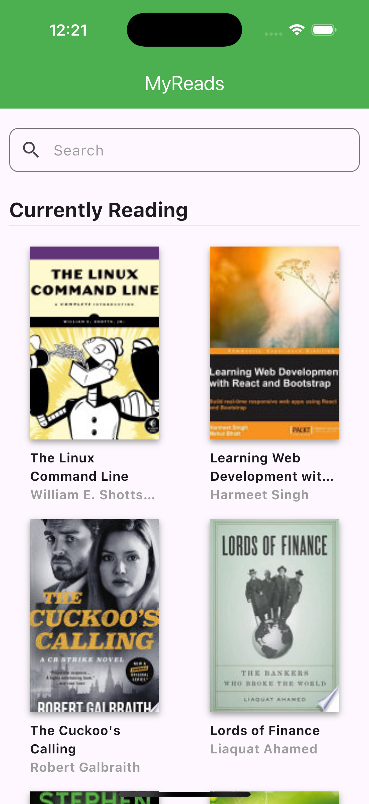
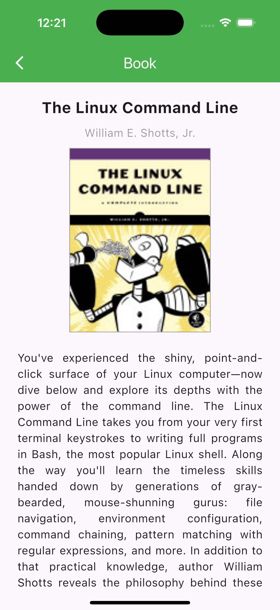

# MyReads (日本語)

`MyReads` は、Flutter を使って構築されたサンプルプロジェクトで、**BLoC** (Business Logic Component) パターンを実装し、**ベストプラクティス** と **レイヤードアーキテクチャ** を使用したアプリケーションの構造化方法を示します。このプロジェクトは、モジュール化され、拡張性があり、保守が容易になるように設計されています。

[English](./README.md) | [Español](./README.es.md) | [Français](./README.fr.md) | [日本語](./README.jp.md)

## プロジェクトの説明

このプロジェクトの主な目的は、レイヤードアーキテクチャを使用してFlutterアプリケーションを構築するための実践的なアプローチを示すことです。保守性と可読性を確保するために、責任が明確に定義されたレイヤーに分割されています。

このプロジェクトは、本のリストや検索、詳細情報など、さまざまな画面を通じてユーザーが操作できる本のアプリケーションをシミュレートします。。

## 機能

- **レイヤードアーキテクチャ**:
  - **Core**: アプリのルーティング、テーマ管理、共有ユーティリティなどのグローバル設定を含みます。
  - **Services**: APIコールや外部統合を管理し、データ取得ロジックをカプセル化します。
  - **Providers**: 状態を管理し、ビジネスロジックを公開するために`provider`パッケージを使用します。
  - **Screens**: ホーム画面や詳細画面など、特定のページのユーザーインターフェースを定義します。
  - **Widgets**: モジュール型レイアウトを構築するための再利用可能なUIコンポーネント。

## スクリーンショット

| **ホーム** | **書籍の詳細** |
|:-----------------------:|:-----------------------:|
|  |  |