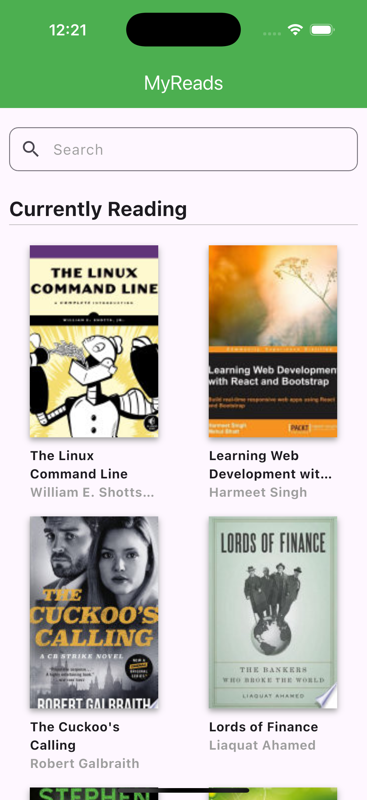

# MyReads (English)

`MyReads` is a sample project built with Flutter that implements the **BLoC** (Business Logic Component) pattern to demonstrate how to structure an application using **best practices** and a **layered architecture**. This project is designed to be modular, scalable, and maintainable by adhering to the principles of separation of concerns.

[English](./README.md) | [Español](./README.es.md) | [Français](./README.fr.md) | [日本語](./README.jp.md)

## Project Description

The primary objective of this project is to illustrate a practical approach to organizing a Flutter application using a layered architecture. It separates responsibilities into well-defined layers to ensure maintainability and readability.

This project simulates a book application where users can browse through various screens, such as a book list, search, and book details.

## Features

- **Layered Architecture**:
  - **Core**: Contains global configurations like app routing, theme management, and shared utilities.
  - **Services**: Manages API calls and external integrations, encapsulating the data-fetching logic.
  - **Providers**: Uses the `provider` package to manage state and expose business logic.
  - **Screens**: Defines the user interface for specific pages, such as the home screen and book detail screen.
  - **Widgets**: Reusable UI components for building modular layouts.

## Screenshots

| **Home** | **Book Detail** |
|:-----------------------:|:-----------------------:|
|  |  |